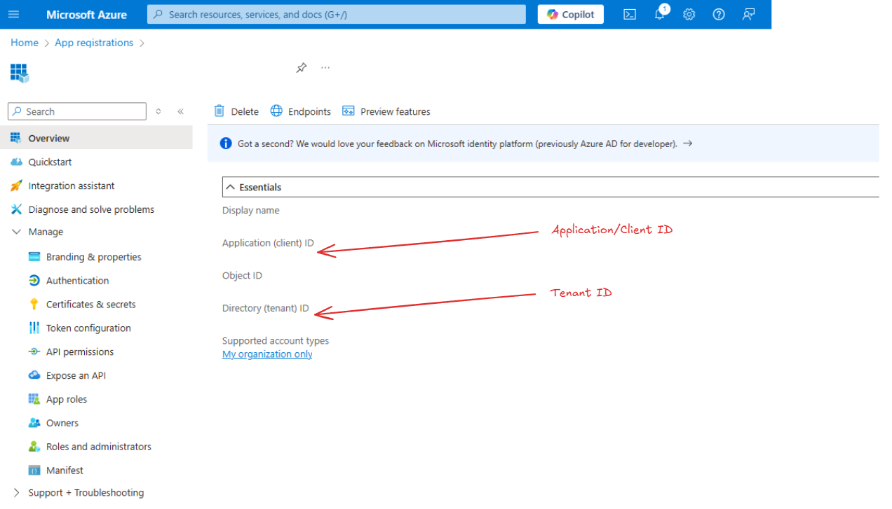

# MCS + Direct Line – Init with Context & Rehydrate Conversations in MCS (Experiment)

## Purpose of this experiment
Our crew set out to discover how **Microsoft Copilot Studio (MCS)** can lift intent detection and routing for a virtual assistant by giving the bot **more context, earlier**. The idea behind this is to give the bot context up-front for **better alignment and understanding** from the very first exchange.

Some examples, but not limited to are:
- Click trail (e.g., *Home → Cards → Apply Now*)
- Current page/feature URL
- Logged-in profile bits (tier, language)
- Device info (mobile/desktop)
- Campaign/referrer tag
- Timezone or locale

Concretely, we wanted answers to five core questions:

1. **Runtime data** – What information can we observe while an MCS bot/agent is running?  
2. **Pre-chat context** – What can we pass to the bot *before* the first message?  
3. **In-chat context** – What can we inject *during* the conversation?  
4. **Post-start context** – What else can we push *after* the chat is already underway?  
5. **Impact** – How does each piece improve intent detection and routing?

---

## TLDR; Quick Glossary (Bot Framework shorthand)

| Term | Meaning |
|------|---------|
| **Direct Line** | Channel that lets any client securely talk to a bot. |
| **Direct Line Secret** | Long-lived server credential used to mint tokens. |
| **Direct Line Token** | 30-60 minute, refreshable bearer credential sent to the client. |
| **Conversation / conversationId** | Unique chat session between 1-n many entities. |
| **Activity** | JSON envelope for every message, event, or system notice. |
| **Watermark** | Pointer so polling clients only fetch new activities. |

---

## Important concepts.. good to know

**Activities**

Activities are the *atoms* of Bot Framework traffic. Each has a type, sender (`from.id`), recipient, timestamp, optional attachments, and much more, checkout the link below for a full comprehensive view and what is possible...
[Bot Framework Activity](research/00-Bot-Framework-Activity-Object.md)

**Architecture and.. mostly everything else**

I have carried out some deep research collaborating with AI but also personally and have aggregated all the information here: [Microsoft Copilot Studio Deep Research](/research/01-Research.md). It may be worth going through the ToC if something is unclear.

---

## Getting Started (Development Environment Setup)


### Prerequisites

> *Step 1 →  Firstly enable gen orchestration for your agent in MCS.


> *Step 2 → Next, create a topic with this yaml code using the code editor in MCS.

```yaml
kind: AdaptiveDialog
beginDialog:
  kind: OnEventActivity
  id: main
  eventName: initialUserData
  actions:
    - kind: SetVariable
      id: setVariable_CaptureEventData
      variable: Global.InitialEventData
      value: =System.Activity.Value

    - kind: SendActivity
      id: sendActivity_ljWeqh
      activity: This is your initiaL EVENT DATA.. {Global.InitialEventData}
```


> *Step 3 → Get the `DIRECT_LINE_SECRET` by grabbing the token here indicated by "Secret 1" to add to your .env file (see step 4 when running the examples), for more info check this link: https://learn.microsoft.com/en-gb/microsoft-copilot-studio/configure-web-security


> *Step 4 → Publish the agent with this new topic and gen orchestration enabled

---

## Run the examples

> *Step 1 → (already scripted/completed – keep for reference)*

# Generating the code for the specs

## Directline v3 API

Use https://converter.swagger.io/#/Converter/convertByUrl to convert the Connector spec here: `https://raw.githubusercontent.com/microsoft/botframework-sdk/main/specs/botframework-protocol/directline-3.0.json`

```bash
MSYS_NO_PATHCONV=1 docker run --rm \
  --user "$(id -u):$(id -g)" \
  -v "${PWD}:/local" \
  openapitools/openapi-generator-cli generate \
    -i /local/openapi-specs/direct-line-3.0.json \
    -g python \
    -o /local/directline-lib \
    --additional-properties "packageName=direct_line,projectName=direct_line,usePydanticV2=true"
```

```bash
pip install -e ./directline-lib
```

---


## Bot Connector API

Use https://converter.swagger.io/#/Converter/convertByUrl to convert the Connector spec here: `https://raw.githubusercontent.com/Microsoft/botbuilder-dotnet/main/libraries/Swagger/ConnectorAPI.json`

```bash
MSYS_NO_PATHCONV=1 docker run --rm \
  --user "$(id -u):$(id -g)" \
  -v "${PWD}:/local" \
  openapitools/openapi-generator-cli generate \
    -i /local/openapi-specs/botConnectorAPIv3-0.json \
    -g python \
    -o /local/botconnector-lib \
    --additional-properties "packageName=bot_connector,projectName=bot_connector,usePydanticV2=true"
```

---

> *Step 2* → Open the repo in a **Dev Container** - this will automatically install the directline-client library (Automatically running `pip install -e ./directline_library` at the project root.`)

> *Step 3* → Rename the `.example.env` file and add your "DIRECT_LINE_SECRET" value, gathered from MCS.

```env
# For direct line 3.0
DIRECT_LINE_SECRET="YOUR_DIRECT_LINE_SECRET"
```

> *Step 4* → Start a conversation:
  - Change directory into the examples directory: `cd examples`
  - Next, run `python start_conversation_with_context.py`

    *Example output:*

    ```bash
    2025-05-09 06:01:42,713  INFO  Creating conversation …
    2025-05-09 06:01:43,118  INFO  Conversation 2XBN9G2DggXANWsMDBi5xm-au ready (token expires in 3600 s)
    2025-05-09 06:01:43,133  INFO  Connecting WebSocket → wss://directline.botframework.com/v3/directline/conversations/2XBN9G2DggXANWsMDBi5xm-au/stream?watermark=-&t=<redacted>
    2025-05-09 06:01:43,362  INFO  WebSocket ✔ connected
    2025-05-09 06:01:44,439  INFO  → initialUserData event sent
    2025-05-09 06:01:44,553  INFO  → greeting message sent
    2025-05-09 06:01:44,553  INFO  Listening for bot replies …  (Ctrl-C to quit)
    2025-05-09 06:01:45,124  INFO  ← Principle Agent: <typing>
    2025-05-09 06:01:47,031  INFO  ← Principle Agent: <event:DynamicPlanReceived>
    2025-05-09 06:01:47,094  INFO  ← Principle Agent: <event:DynamicPlanReceivedDebug>
    2025-05-09 06:01:47,168  INFO  ← Principle Agent: <event:DynamicPlanStepTriggered>
    2025-05-09 06:01:47,226  INFO  ← Principle Agent: <event:DynamicPlanStepBindUpdate>
    2025-05-09 06:01:48,743  INFO  ← Principle Agent: <event:UniversalSearchToolTraceData>
    2025-05-09 06:01:48,805  INFO  ← Principle Agent: <event:DynamicPlanStepFinished>
    2025-05-09 06:01:48,971  INFO  ← Principle Agent: <typing>
    2025-05-09 06:01:50,786  INFO  ← Principle Agent: Hello! Welcome to our bank. I am an automated assistant here to help you with your banking needs. How can I assist you …
    2025-05-09 06:01:50,862  INFO  ← Principle Agent: <event:DynamicPlanFinished>
    2025-05-09 06:02:50,867  WARNING  No activity for 60 s — closing WS
    2025-05-09 06:02:50,895  INFO  Transcript saved → data/conversation_activities/2XBN9G2DggXANWsMDBi5xm-au/20250509_060142_2XBN9G2DggXANWsMDBi5xm-au.json
    2025-05-09 06:02:50,896  INFO  Done.
    ```

> *Step 5* → Inspect the full transcript and view most of the activties:
  - From the example directory, run `python conversation_activity_viewer.py <conversationId>`

> *Step 6* → Rehydrate a conversation:
  - From the example directory, run `python rehydrate_and_continue_conversation.py <conversationId>`

    *Example output for conversationId:* `1jNnyAGTQXgAHzNe3GvHp6-au`:

    ```bash
    2025-05-09 06:01:42,713  INFO  Creating conversation …
    2025-05-09 06:01:43,118  INFO  Conversation 2XBN9G2DggXANWsMDBi5xm-au ready (token expires in 3600 s)
    2025-05-09 06:01:43,133  INFO  Connecting WebSocket → wss://directline.botframework.com/v3/directline/conversations/2XBN9G2DggXANWsMDBi5xm-au/stream?watermark=-&t=<redacted>
    2025-05-09 06:01:43,362  INFO  WebSocket ✔ connected
    2025-05-09 06:01:44,439  INFO  → initialUserData event sent
    2025-05-09 06:01:44,553  INFO  → greeting message sent
    2025-05-09 06:01:44,553  INFO  Listening for bot replies …  (Ctrl-C to quit)
    2025-05-09 06:01:45,124  INFO  ← Principle Agent: <typing>
    2025-05-09 06:01:47,031  INFO  ← Principle Agent: <event:DynamicPlanReceived>
    2025-05-09 06:01:47,094  INFO  ← Principle Agent: <event:DynamicPlanReceivedDebug>
    2025-05-09 06:01:47,168  INFO  ← Principle Agent: <event:DynamicPlanStepTriggered>
    2025-05-09 06:01:47,226  INFO  ← Principle Agent: <event:DynamicPlanStepBindUpdate>
    2025-05-09 06:01:48,743  INFO  ← Principle Agent: <event:UniversalSearchToolTraceData>
    2025-05-09 06:01:48,805  INFO  ← Principle Agent: <event:DynamicPlanStepFinished>
    2025-05-09 06:01:48,971  INFO  ← Principle Agent: <typing>
    2025-05-09 06:01:50,786  INFO  ← Principle Agent: Hello! Welcome to our bank. I am an automated assistant here to help you with your banking needs. How can I assist you …
    2025-05-09 06:01:50,862  INFO  ← Principle Agent: <event:DynamicPlanFinished>
    2025-05-09 06:02:50,867  WARNING  No activity for 60 s — closing WS
    2025-05-09 06:02:50,895  INFO  Transcript saved → data/conversation_activities/2XBN9G2DggXANWsMDBi5xm-au/20250509_060142_2XBN9G2DggXANWsMDBi5xm-au.json
    2025-05-09 06:02:50,896  INFO  Done.
    ```


## Setting up Dataverse env variables:

> 1. Grab your WEB_API_ENDPOINT + TENANTID in Power Platform Admin Center


> 2. Grab your CLIENT_ID + CLIENT_SECRET in Azure Portal under App Registrations *Note: (Application ID is same as CLIENT_ID)*





Enable dataverse search to view in tables
https://learn.microsoft.com/en-gb/power-platform/admin/configure-relevance-search-organization?tabs=new#set-up-dataverse-search


